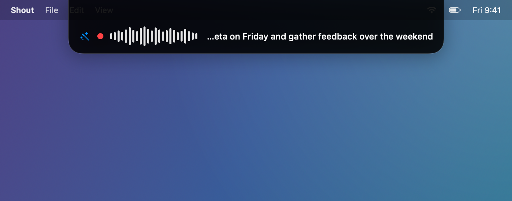
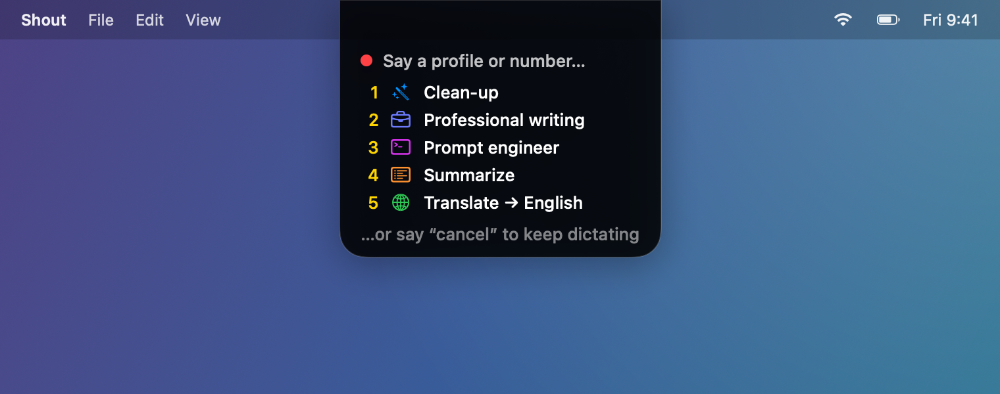

# Shout

[](LICENSE)

Local-first, push-to-talk dictation for macOS. Hold the **fn** key, speak German or English into
any text field, release — and fluent, cleaned-up text is inserted where your cursor is.
**Everything runs on your Mac by default — your audio never leaves the device, and your text
stays on it too unless you deliberately connect a remote cleanup model.**

Dictation supports German and English; the interface is English.

> **Status:** developer build. Shout is currently built from source (there is no notarized
> download yet), so setup assumes Xcode and the command line.

## What it does

Shout lives in the menu bar. You hold a key, talk, and let go; it transcribes your speech
on-device with whisper.cpp, cleans it up with Apple Intelligence (removing "ähm"s, false
starts, and fixing grammar), and pastes the result into whatever app you're in. If Apple
Intelligence is off or unsure, it inserts the raw transcript instead — dictation never blocks.

<p align="center">
  
</p>

A floating pill reports each stage — listening, transcribing, polishing, inserted — in a classic
capsule or as a Dynamic Island notch:

<p align="center">
  
  
</p>

## Requirements

- **macOS 26 or later**, on **Apple Silicon**
- **Xcode 26 or later** — the full Xcode, not just the Command Line Tools. Shout uses the
  `FoundationModels` framework, so the macOS 26 SDK is required to compile at all. Point
  `xcode-select -p` at it.
- **~2.5 GB free disk** — the speech model (~1.6 GB), the whisper framework (~184 MB), and build
  output
- **Apple Intelligence** enabled — *optional*, only for the cleanup pass; transcription works without it

## Install

```sh
git clone https://github.com/Andreas-Menzel/shout-ai.git shout-ai
cd shout-ai

make setup            # one-time: downloads the 1.6 GB speech model
make cert             # recommended, one-time: a stable signing identity (see note below)
make run              # builds build/Shout.app and opens it
```

The whisper.cpp framework (~184 MB) is fetched and checksum-verified by SwiftPM itself, so
`swift build` and `swift test` work straight from a fresh clone — `make setup` only downloads
the speech model you need in order to dictate.

`make run` builds the app into `build/Shout.app` and launches it. Because there is no signed
release yet, you build it yourself.

**Why `make cert`?** macOS ties privacy permissions to an app's code signature. With an ad-hoc
signature, *every rebuild looks like a new app*, so your granted permissions go stale. `make cert`
creates one stable self-signed identity ("Shout Dev Signing") so permissions survive rebuilds.
macOS will ask for your login password to trust it, and for "Always Allow" on the first build.
An **Apple Development** certificate (Xcode ▸ Settings ▸ Accounts ▸ Manage Certificates ▸ +)
works too.

## First-run setup (the app walks you through this)

1. Grant **Microphone**, **Input Monitoring**, and **Accessibility** permissions. Shout also
   requests **Post Events** the first time it pastes text.
   **One prompt is not in the checklist:** if Spotify or Apple Music is running when you dictate,
   macOS asks for **Automation** ("Shout wants to control Spotify") — Shout pauses playback while
   you speak and resumes afterwards. Declining is fine; dictation is unaffected. Turn it off
   under *Settings ▸ Dictation ▸ While dictating* if you'd rather never see it.
2. System Settings › Keyboard › **"Press 🌐 key to" → "Do Nothing"**
   (otherwise macOS's own dictation/emoji picker fights over the fn key).
3. System Settings › **Apple Intelligence & Siri → enable Apple Intelligence**
   (needed for the cleanup pass; transcription works without it).

The Setup Assistant window opens on first launch and reports the live state of each item.
You can reopen it anytime from the menu bar (**Setup Assistant…**).

## Using Shout

Shout is a menu-bar app (a mic icon near the clock). Click it for the active **profile** and a
switcher, plus status and actions: Start/Finish dictation, **Pause Shout** (frees the fn key for
other apps without quitting), History…, Setup Assistant…, Settings…, and Quit.

**Dictating:**

- **Hold fn** and speak, release to insert (push-to-talk).
- **Double-tap fn** to lock hands-free recording; **tap fn** again to finish.
- **Esc** cancels — while recording *or* during transcription/cleanup.
- Dictations under 4 words (configurable) skip the cleanup pass and insert the raw transcript.
- A floating **pill** shows the current state (listening / transcribing / polishing / inserted).
  "Inserted raw" means the cleanup was skipped or fell back, so you may want to proofread.
- If Spotify or Apple Music is playing, Shout pauses it while you speak and resumes afterwards
  (*Settings ▸ Dictation ▸ While dictating*, on by default).

### Profiles

A profile decides *what* Shout does with your words after transcribing them. Five ship with the
app, and the active one is shown (and switchable) at the top of the menu bar:

| Profile | What it does |
|---|---|
| **Clean-up** | The default. Removes fillers and revoked false starts, fixes grammar and punctuation, keeps everything else. |
| **Professional writing** | Rewrites the same content in a polished register, inventing nothing. |
| **Prompt engineer** | Turns a spoken request into a structured prompt for an AI assistant — without answering it. |
| **Summarize** | Plain-text `- ` bullets, keeping who does what exactly as spoken. |
| **Translate → English** | Natural English; already-English input is only cleaned, not rephrased. |

Add your own under *Settings ▸ Dictation ▸ Manage profiles…* — duplicate a built-in or start
fresh, then set its prompt, its cleanup model, and a glyph and tint so you can tell profiles
apart at a glance. Editing a built-in is fine; Shout only replaces a built-in's prompt on upgrade
if you never touched it.

<p align="center">
  
</p>

### Switching profiles by voice

Off by default. Turn on *Settings ▸ Dictation ▸ Switch profile by voice* and you can start a
dictation with a trigger phrase — "**use profile** summarize, …" or "**use profile** two, …" —
and the rest of the dictation runs through that profile. The pill shows the profile name the
moment it recognizes it, and a soft tick confirms it: whatever the pill shows when you stop
recording is exactly what runs. Misheard? Say the name or number again, or say a cancel word
("cancel", "abbrechen") to keep going with the current profile. The trigger phrase, cancel words,
and whether the switch sticks for later dictations are all configurable.

**Settings** (from the menu bar):

- *General* — launch at login, show/style the pill (Classic capsule or Dynamic Island notch),
  live transcript preview, and **Save dictation history**.
- *Dictation* — spoken language (auto / German / English), the fn hold threshold and double-tap
  window, the cleanup toggle with its minimum-word count, the active profile and its model
  (*Manage profiles…* / *Manage endpoints…*), restore clipboard after inserting, pause media
  while dictating, and voice profile switching.
- *Glossary* — names and jargon Shout should spell exactly (e.g. product or people names).
- *Setup* — the permission checklist, available any time.

**History** — every dictation (raw + cleaned) is kept locally so you can review, search, copy,
or delete it. Turn it off with *General ▸ Save dictation history*, or clear it all from the
History window. History is never uploaded.

## Troubleshooting

- **The fn key only works inside Shout.** Input Monitoring isn't fully granted. Open Setup,
  grant it, and use **Restart Shout** — a running process can't pick up this permission live.
- **Permissions look enabled but nothing happens after a rebuild.** An ad-hoc signature made the
  entries stale. Run `make reset-permissions`, then re-grant them in Setup — or run `make cert`
  once so this stops happening.
- **"Downloading speech model…" or "not installed".** Open Setup and let the model finish
  downloading (or retry). An incomplete download is detected by its exact byte size and never
  loaded, and every completed download is checked against a pinned SHA-256 before use — so a
  truncated or tampered-with file is discarded rather than half-working.
- **Text isn't inserted.** Grant **Accessibility** (the pill/notification says "grant
  Accessibility, press ⌘V"). Your text is kept on the clipboard so nothing is lost.
- **fn triggers macOS dictation or the emoji picker.** Set System Settings › Keyboard ›
  "Press 🌐 key to" → "Do Nothing".
- **Cleanup is skipped ("Inserted raw").** Apple Intelligence is off/unavailable, or the result
  failed a quality check — the raw transcript is inserted. Enable Apple Intelligence in System
  Settings to get the cleanup pass.

## Uninstall

Shout is self-contained, but it does touch a few system areas. To remove it completely:

```sh
# 1. Quit Shout (menu bar ▸ Quit) and turn OFF "Launch at login" first
#    (Settings ▸ General, or System Settings ▸ General ▸ Login Items).

# 2. Delete the app and build output
rm -rf build/Shout.app
make clean                     # removes .build and build/

# 3. Delete on-device data (the ~1.6 GB model, history, and any diagnostics)
rm -rf "$HOME/Library/Application Support/Shout"

# 4. Delete preferences
defaults delete com.shoutai.Shout 2>/dev/null || true

# 5. Delete any stored endpoint API keys (repeat until it reports no item found;
#    or search for "Shout" in Keychain Access and delete the entries there)
security delete-generic-password -s "com.shoutai.Shout.endpoint-key" 2>/dev/null || true

# 6. Reset the privacy permissions granted to Shout
make reset-permissions         # Accessibility, Input Monitoring, Post Events,
                               # Microphone, Automation

# 7. If you ran `make cert`, remove the self-signed identity
security delete-identity -c "Shout Dev Signing" 2>/dev/null || true
```

`make clean` in step 2 also removes the fetched whisper framework, which lives under `.build/`.

Finally, revert System Settings › Keyboard › **"Press 🌐 key to"** back to your preferred value
(it was set to "Do Nothing" during setup).

## Privacy & your data

By default everything runs on your Mac — audio is captured in memory only (never written to
disk), transcription and cleanup are on-device, and the only network request Shout makes on its
own is the one-time model download.

**The one exception is a remote cleanup model.** If you add an OpenAI-compatible endpoint on a
non-local host (Settings ▸ Dictation ▸ *Manage endpoints…*) and select it, that dictation's
**transcript text** is sent to that server to be cleaned up. Shout marks such models as leaving
your Mac — in the model list, in a warning under the picker, and with an indicator on the pill
while it runs — so it never happens silently. Your **audio** still never leaves the device, and
the on-device Apple Intelligence model remains the default. It writes four things locally:

- Speech model: `~/Library/Application Support/Shout/models/ggml-large-v3-turbo.bin`
- Dictation history: `~/Library/Application Support/Shout/history.json` (optional — see Settings)
- Preferences: the `com.shoutai.Shout` domain
- Endpoint API keys: your login Keychain, service `com.shoutai.Shout.endpoint-key` — only if you
  add an endpoint that needs one. Keys are never written to the preferences file.

## Contributing / developing

See [CONTRIBUTING.md](CONTRIBUTING.md) to get started. Architecture, build targets, tests, and
debugging tools live in [docs/DEVELOPMENT.md](docs/DEVELOPMENT.md).

## Version & license

Shout is at **v0.1.0** (developer preview).

It is free software under the **GNU General Public License v3.0-or-later** — see
[LICENSE](LICENSE). You may use, study, share, and modify it; derivative works must stay under
the GPL. Copyright © 2026 Andreas Menzel.

### Acknowledgements

Shout stands on excellent open-source work:

- **[whisper.cpp](https://github.com/ggml-org/whisper.cpp)** and **[ggml](https://github.com/ggml-org/ggml)** (MIT) — on-device speech transcription.
- **[OpenAI Whisper](https://github.com/openai/whisper)** (MIT) — the `large-v3-turbo` speech model, downloaded at setup.

Full third-party notices are in [THIRD-PARTY-LICENSES.md](THIRD-PARTY-LICENSES.md).
